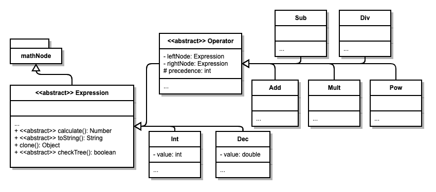
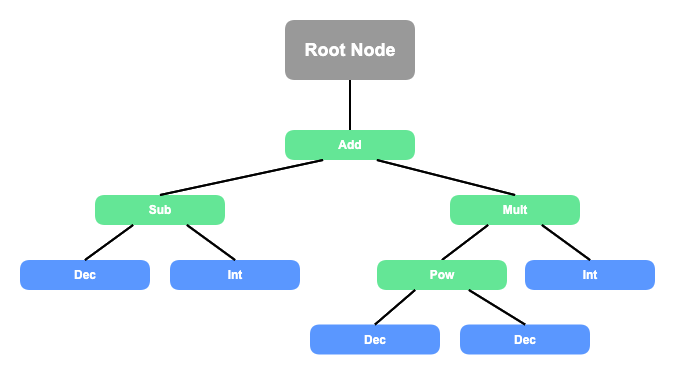

# Simple Math Parser
A console calculator application with a homemade math parsing tree. If you want to try it out for yourself, checkout CalcApp.java and testMathTree.java.

## How MathTree Class Works
Essentially, the MathTree data structure takes a string and builds a parsing tree. If it fails because the input string is an invalid math statement, it deletes the tree and returns false.

### 1. Scanning The String
This breaks up the string into tokens which can be used to build the tree later on.
#### _First Pass_
The first pass breaks up the string based upon delimiters, in this case whitespace characters, and special characters, in this case operators and parenthesis. This step is executed by strScanner in MathTree. It returns a list of strings.
>5+5 * 85 --> {"5", "+", "5", "*", "85"}
#### _Second Pass_
The second pass takes the list of strings and handles special cases. It discerns the difference between subtraction and negation symbols. It also applies implicit multiplication with parenthesis.
>5--5 --> {"5", "-", "-5"}

>5- 5 --> {"5", "-", "5"}

>5 -5 --> {"5", "-5"}

>5(6) --> {"5", "*", "(", "6", ")"}

>5+ (6) --> {"5", "+", "(", "6", ")"}

>(7+6) 4 --> {"(", "7", "+", "6", ")", "*", "4"}
### 2. Building The Tree
The tree is build according to math precedence rules. Expressions are solved from left to right unless the operation on the right has higher precedence.
#### _Math Expression Nodes_

The operator nodes have links to a left and right node. Number nodes, Int and Dec, do not have links to other nodes. The nodes have built in recursive operations for calculate(), toString(), clone(), and checkTree().
>Expression.calculate(): Calculates result of all the operations below this node and returns a Number object.

>Expression.toString(): Returns the string value of the entire tree below this node.

>Expression.clone(): Returns a clone of the entire tree below this node.

>Expression.checkTree(): Returns a bool based upon if the tree has been constructed correctly.

#### _Inserting Nodes_
Nodes are always inserted in the right side of the tree because math expression are always evaluated left to right. Operators are compared starting from the top of the tree with other operator nodes to find the right spot based upon precedence. Number nodes are added to the rightmost bottom part of the tree.

